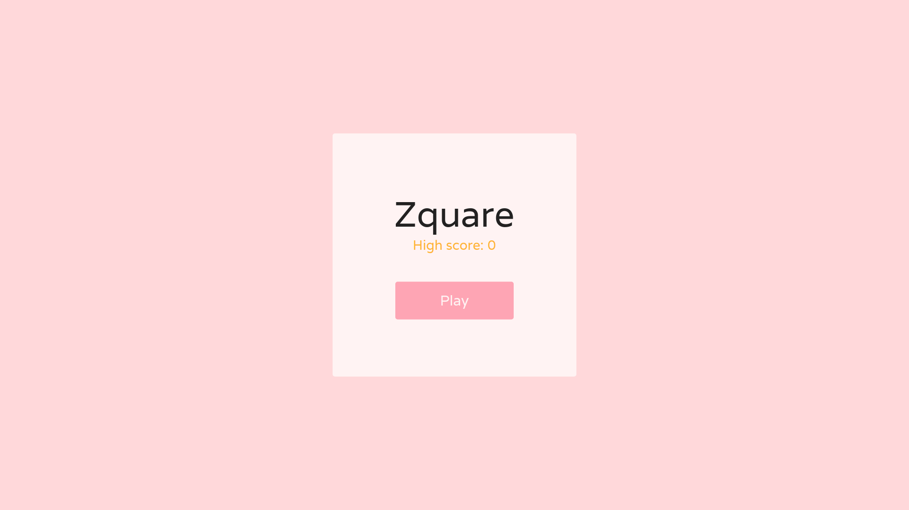
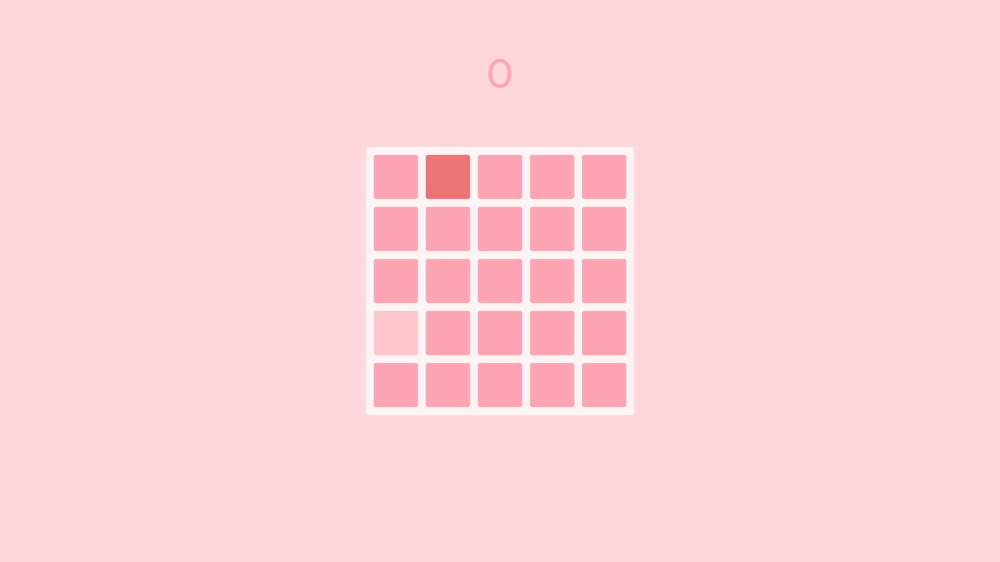
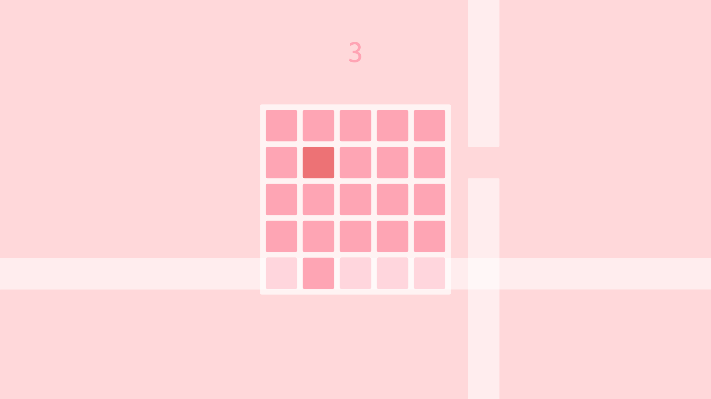
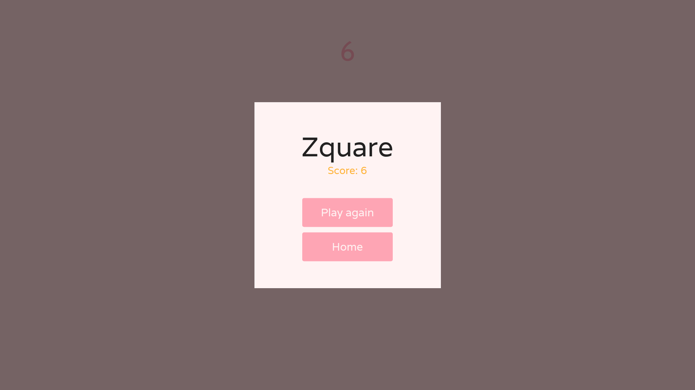

# Zquare 🎮 [  ]

⭐️ this repo if you like it.

## Getting Started 🚀

- Clone the repo
- Install the dependicies
- Run it

## Try in web 
####https://definev.github.io/zquare

## Image 📸

## Feature 🚀
- An example of awesome getx library implementation.
- Simple and clear.

## Contact me 📧
#### Email : big.plus.uwu@gmail.com
#### Facebook : https://www.facebook.com/definev